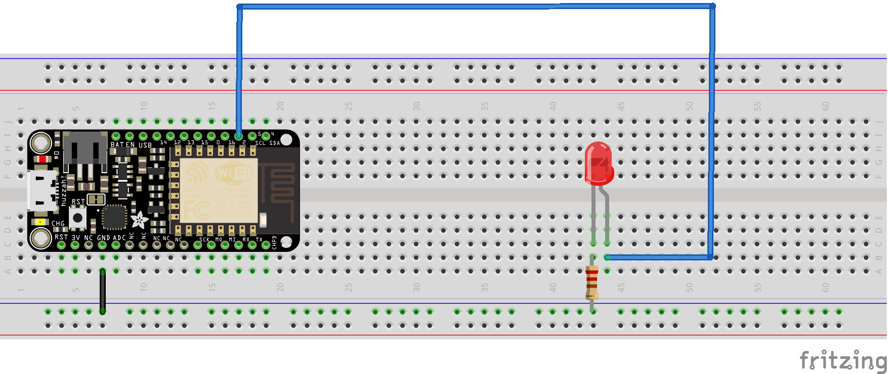

# Receive data from VAE lagging encoder poetry with Feather Huzzah

In this example we will look into how to receive data from  runway with the **feather huzzah** board wirelessly via the **http** protocol.

The feather huzzah is board manufactured by Adafruit, it has a wifi (ESP8266) and a built-in battery port.

The goal will be to use runway to navigate the latent space of the VAE lagging encoder poetry model, send the contents of the selected cell to arduino and transform it into morse code using a LED.

The morse code part is adapted from [this ressource](https://www.instructables.com/id/Arduino-Based-Text-to-Morse-Translator/) made by R. Kundagrami and edited by Dr. J Leclerc at the Univerity of Houston Department of Mechanical Engineering.

## List of parts necessary

- a feather huzzah
- a breadboard
- 220 ohms resistor
- a simple LED


## Setup the feather with arduino IDE
First you will want to setup your arduino IDE to work with this board following these instructions : https://learn.adafruit.com/adafruit-feather-huzzah-esp8266/using-arduino-ide

## RunwayML setup
The runwayml is pretty straight forward :
- in the model directory look for the "VAE lagging encoder" model which enable you to navigate through a grid of "semantically and syntactically similar lines of poetry".
- run it 
- click on the network tab.
- make sure that in the input window http is selected.

Note : in the overview of the model Allison Parrish (who ported the model) says "When using Runway's Vector interface for generation, I recommend using lower temperatures (<0.3) and high neighbor similarity (>0.8), to highlight the similarity between lines produced from nearby points in the latent space."

The network tab will give usefull informations on how the output will be formatted eg **Output Specification**, the **server address** and **port** number, aswell as the usable **routes** to get/send data from/to the model.

In our case :

- we should receive a **JSON** string with this kind of data :

    ```json
    {
   "out": "my-line-of-poetry"
    }
    ```

- we want to receive data from runwayml so we need to use the **GET** route on arduino from our computer running runway so our httpRoute will look something like:

    ```
    http://my-computer-ip:runway-port/data
    ```

So you should be sure to know the ip-adress of your computer, and take note of the port runway has allocated for our model to listen to.


## The circuit

Our circuit will be as follows :



It is a classic circuit, we use a resistor to protect our LED, it may not be necessary to so.


## Code break down

### Handling wifi connection

For wifi communication, the standard wifi library included with arduino IDE is used. So you shouldn't have to install anything.

The import of the lib is as follows :

```c
#include <ESP8266WiFi.h>
#include <ESP8266WiFiMulti.h>
#include <ESP8266HTTPClient.h>
#include <WiFiClient.h>
```

At the top of the program some constants are defined to put it in you custom connection settings (line 10 to 13)

```c
ESP8266WiFiMulti WiFiMulti;
const char* ssid = "put-your-wifi-ssid-here"; // wifi ID
const char* pass = "put-your-wifi-password-here"; // wifi password
const char* host = "http://192.168.8.102:8000/data"; // route provided by runway
```
You should enter your own values for **ssid** and **pass** according to your wifi network.

As previously mentionned the **host** setting should match your **ip** address on the network (the one of the computer running runway) and the **port** given by runway in the network pannel. 

You should **make sure that the computer running runway and the arduino board are on the same wifi network.**

Once those settings are ok. The code uses only two functions built from the examples shipped with the library.

- **wifi_connect()** : it takes no parameters, and should be run once in the setup(). It uses the constants to connect to the wifi network and should print *"connected : 1"* in the serial console if the connection is successfull. If the board did not manage to connect it would say *"connected : 0"*, and you may want to check you ssid or pass constants.

- **http_get()** : returns a JSON formatted String matching the output specifications of runway (available in the network tab).

In the setup of the arduino program you should first open a serial connection and then call the **connnect_wifi()** function :

```c
Serial.begin(115200);
wifi_connect();
```

In the loop function of the arduino program you just have to create a variable to store a String and if you want print it to serial output - just to be sure the connection does work :

```c
// print if we are connected
  Serial.println("");
  Serial.print("connected : ");
  Serial.println(WiFiMulti.run() == WL_CONNECTED );
  Serial.println("");

  // get the data and serialize it to read it as a json object
  String dat = http_get(); // get the data from arduino as a string
  Serial.println(dat); // print the raw data from runway
```

### Parsing data as a JSON string

The code uses the amazing [arduinoJson](https://arduinojson.org/) library. Which has a great documentation and a lot of examples.

```c
#include <ArduinoJson.h>
```

To create a JSON type of document, you should ideally know the size of the data you need to store in it. In our case we don't really know the size or it may change according to our explorations. We will fix the size to 500 but you may have to change it to retrieve bigger chunks of text. Once the JSON variable is created you can *deserialize* your String.

```c
// Use arduinojson.org/assistant to compute the capacity.
// We don't really know the size in this case so might want to adjust it for longer bits of text
StaticJsonDocument<500> doc;
deserializeJson(doc, dat); // write the result from httpget to a JSON doc
```

Now we can access the content of the data received with a classic JSON syntax.

```c
String out = doc["out"]; // extract the line corresponding to the "out" key
Serial.prinln(out);
```
All we have to do now is to transform this string into morse code using the ressource mentionned earlier.

### from string to blinking led using morse code !

So taking up the tutorial we will need to have three variables : one for the pin the led is plugged in, one for the time base, and one for the dash (to separate words).

```c
const int ledPin = 2; // use the D2 pin to light our led
const int time_base = 50; // sets a dot to 50 milliseconds
const int dash = 3 * time_base; // sets a dash to 150 milliseconds
````

In the setup we need to declare that our pin 2 is used as an "output" (to generate current)

```c
pinMode(ledPin, OUTPUT);
```

In the loop we will just use a for loop to go through each letter of our string and call the **morse_alphabet()** function, which has been adapted from our ressource. It just takes a character as a parameter and executes **digitalWrite(ledPin, HIGH)** / **digitalWrite(ledPin, LOW)** / and **delay()** according to the tutorial.

```c
// run through ou line character by character and make it blink our led.
for (int i = 0 ; i < out.length() ; i++) {
    Serial.println(out.charAt(i));
    morse_alphabet(out.charAt(i));
}
```

At the end of the sentence we will included a longer delay before taking another one in

```c
  // take some time before the next line
  digitalWrite(ledPin, LOW);
  delay(1000);
```


