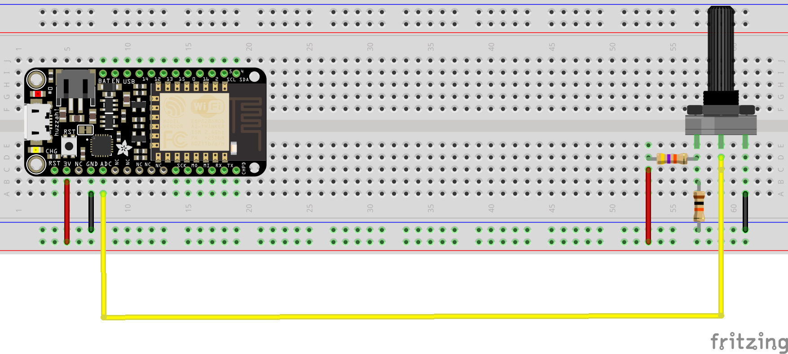

# Send data to AttnGAN from Feather Huzzah

In this example we will look into how to send data from the **feather huzzah** board to runway wirelessly via the **http** protocol.

The feather huzzah is board manufactured by Adafruit, it has a wifi (ESP8266) and a built-in battery port.

The goal will be to use a potentiometer to navigate through the lines of a poetry and generate an image for each line using the AttnGAN model.

## List of parts necessary

- a feather huzzah
- a breadboard
- a 10kohms potentiometer
- 10k resistance
- 47k or 22k resistance

## Setup the feather with arduino IDE
First you will want to setup your arduino IDE to work with this board following these instructions : https://learn.adafruit.com/adafruit-feather-huzzah-esp8266/using-arduino-ide

## RunwayML setup
The runwayml is pretty straight forward :
- in the model directory look for the "AttnGAN" model which will take up some text to transform it to an image.
- run it 
- click on the network tab.
- make sure that in the input window http is selected.

The network tab will give usefull informations on how the input should be formatted eg **Input Specification**, the **server address** and **port** number, aswell as the usable **routes** to get/send data from/to the model.

In our case :

- we should send a **JSON** string with this kind of data :

    ```json
    {"caption":"the text I want to translate to image"}
    ```

- we want to send data to runwayml so we need to use the **POST** route from arduino to our computer running runway so our httpRoute will look something like:

    ```
    http://my-computer-ip:runway-port/query
    ```

So you should be sure to know the ip-adress of your computer, and take note of the port runway has allocated for our model to listen to.


## The circuit

Our circuit will be as follows :



Note that the feather only has only a 3.3V power pin, and we need to make a voltage divider with resistors to read the full range of our potentiometer.

You can find more information at this address : https://learn.adafruit.com/micropython-hardware-analog-i-o/analog-to-digital-converter


## Code break down

### Getting data from the potentiometer and map it

First we need to be sure that our circuit works and that we get data from our potentiometer.

In the **setup()** you should open a Serial communication port to be able to visualize the data comming from the arduino on your computer.

```c
Serial.begin(115200);
```

We connected the potentiometer to the A0 pin so we can read its value by writing in the **loop()**:

```c
Serial.prinln(analogRead(17));
```

So when you manipulate the potentiometer you should see a value changing in the serial log window of arduino ide.

Now we need to make the data from our potentiometer correspond to a phrase in our poem.

The poem is stored as an array of strings :

```c
// Robert Frost - The Road not taken
// https://www.poetryfoundation.org/poems/44272/the-road-not-taken
String  poem [] = {
  "Two roads diverged in a yellow wood,",
  "And sorry I could not travel both",
  "And be one traveler, long I stood",
  "And looked down one as far as I could",
  "To where it bent in the undergrowth;",
  "Then took the other, as just as fair,",
  "And having perhaps the better claim,",
  "Because it was grassy and wanted wear;",
  "Though as for that the passing there",
  "Had worn them really about the same,",
  "And both that morning equally lay",
  "In leaves no step had trodden black.",
  "Oh, I kept the first for another day!",
  "Yet knowing how way leads on to way,",
  "I doubted if I should ever come back.",
  "I shall be telling this with a sigh",
  "Somewhere ages and ages hence:",
  "Two roads diverged in a wood, and I—",
  "I took the one less traveled by,",
  "And that has made all the difference."
};

```
So we need to [**map()**](https://www.arduino.cc/reference/en/language/functions/math/map/) the value we read to an index value so that when the potentiometer is at its minimum value we get an index of zero (and be able to retrieve the first line), and when it is at its maximum value we get the index of nineteen (ie the last line).

note: in C it can be difficult to retrieve the size of an array. [**sizeof()**](https://www.arduino.cc/reference/en/language/variables/utilities/sizeof/) returns the number of bytes and not the number of elements. So we will use and hardcoded value.

```c
 int index = map(analogRead(17), 0, 340, 0, 19);
```

Your values my be a bit different according to the resistors you used.

Finally, if we want to read the values at each iteration we don't want to send a http post each time : especially if the value didn't change.

To do that we can use a global variable (defined at line 41, just before the setup()).

```c
int pindex = 0;
```

and check wether its value is similar to the value with compute : if they are similar we do nothing, if they are not we need to create a json string and send it via http (see next steps)

```c
if (pindex != index) {
    pindex = index;
    //(... do some stuff ... send data ...)
}
```

### Formatting data as a JSON string

The code uses the amazing [arduinoJson](https://arduinojson.org/) library. Which has a great documentation and a lot of examples.

```c
#include <ArduinoJson.h>
```

To create a JSON type of document, you should ideally know the size of the data you need to store in it. You need to first create a variable with a static size, "transform" it as a JsonObject and then add data to it.

```c
StaticJsonDocument<500> doc; // create a static document
JsonObject root = doc.to<JsonObject>(); // make it a json object
// Add data to it : key == "caption" / content == line from our poem
root["caption"] = poem[index];
```

You can compute the size needed by visiting :  https://arduinojson.org/v5/assistant/

Once it is done you can use the [**serializeJson()**](https://arduinojson.org/v6/api/json/serializejson/) function to either :

- print the result to the serial console
    ```c
    serializeJson(root, Serial); // print   json to serial output
    ```

- store it in a new variable
    ```c
    String json;
    serializeJson(root, json);
    ````

You can now post this String to runway using the **http_post()** method detailed below !

```c
http_post(json);
```

### Handling wifi connection

For wifi communication, the standard wifi library included with arduino IDE is used. So you shouldn't have to install anything.

The import of the lib is as follows :

```c
#include <ESP8266WiFi.h>
#include <ESP8266WiFiMulti.h>
#include <ESP8266HTTPClient.h>
#include <WiFiClient.h>
```

At the top of the program some constants are defined to put it in you custom connection settings (line 10 to 13)

```c
ESP8266WiFiMulti WiFiMulti;
const char* ssid = "put-your-wifi-ssid-here"; // wifi ID
const char* pass = "put-your-wifi-password-here"; // wifi password
const char* host = "http://192.168.8.102:8000/query"; // route provided by runway
```
You should enter your own values for **ssid** and **pass** according to your wifi network.

As previously mentionned the **host** setting should match your **ip** address on the network (the one of the computer running runway) and the **port** given by runway in the network pannel. 

You should **make sure that the computer running runway and the arduino board are on the same wifi network.**

Once those settings are ok. The code uses only two functions built from the examples shipped with the library.

- **wifi_connect()** : it takes no parameters, and should be run once in the setup(). It uses the constants to connect to the wifi network and should print *"connected : 1"* in the serial console if the connection is successfull. If the board did not manage to connect it would say *"connected : 0"*, and you may want to check you ssid or pass constants.

- **http_post()** : takes a string in the json format as a parameter to send it via http. Each time it sends something it prints out information about the process including http error codes (or success).


