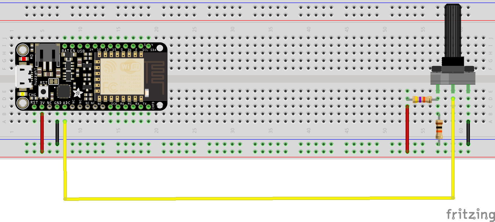

# Send data to BigGan from Feather Huzzah

In this example we will look into how to send data from the **feather huzzah** board to runway wirelessly via the **http** protocol.

The feather huzzah is board manufactured by Adafruit, it has a wifi (ESP8266) and a built-in battery port.

The goal will be to use a potentiometer to navigate through the latent space. The idea is to do an interpolation between two images (eg two exported vectors).

## List of parts necessary

- a feather huzzah
- a breadboard
- a 10kohms potentiometer
- 10k resistance
- 47k or 22k resistance

## Setup the feather with arduino IDE
First you will want to setup your arduino IDE to work with this board following these instructions : https://learn.adafruit.com/adafruit-feather-huzzah-esp8266/using-arduino-ide

## RunwayML setup
The runwayml is pretty straight forward :
- in the model directory look for the "BigGAN" model which will take up a vector of 140 floats to transform it to an image.
- run it 
- click on the network tab.
- make sure that in the input window http is selected.

The network tab will give usefull informations on how the input should be formatted eg **Input Specification**, the **server address** and **port** number, aswell as the usable **routes** to get/send data from/to the model.

In our case :

- we should send a **JSON** string with this kind of data :

    ```json
    {
        "category":"some-biggan-category",
        "z":[0.038764, -0.94245 (...)] 
    }
    ```

- we want to send data to runwayml so we need to use the **POST** route from arduino to our computer running runway so our httpRoute will look something like:

    ```
    http://my-computer-ip:runway-port/query
    ```

So you should be sure to know the ip-adress of your computer, and take note of the port runway has allocated for our model to listen to.


## The circuit

Our circuit will be as follows :



Note that the feather only has only a 3.3V power pin, and we need to make a voltage divider with resistors to read the full range of our potentiometer.

You can find more information at this address : https://learn.adafruit.com/micropython-hardware-analog-i-o/analog-to-digital-converter


## Code break down

### Getting data from the potentiometer and map it

First we need to be sure that our circuit works and that we get data from our potentiometer.

In the **setup()** you should open a Serial communication port to be able to visualize the data comming from the arduino on your computer.

```c
Serial.begin(115200);
```

We connected the potentiometer to the A0 pin so we can read its value by writing in the **loop()**:

```c
Serial.prinln(analogRead(17));
```

So when you manipulate the potentiometer you should see a value changing in the serial log window of arduino ide.

Now we need to make the data from our potentiometer correspond to a vector (eg an array of 140 floats). 

For this we will interpolate between two vectors exported from a manual exploration of the bigGan latent space. You can easily do that by : 
    - running the model, 
    - selecting a category, 
    - choose an image,
    - and click the "export vector as JSON" button in the input pannel (where the latent space is displayed).

The vectors can now be stored as two arrays of floats as global constants   

```c
// two vectors exported from runway used as bounds for the interpolation
float  vector1 [] = { 0.2273744317223756,-0.8174532165457828,0.35366239427218665,-0.17851218639521174,-0.12692330404852248,0.015140817695536546,0.23020203208886433,0.12565617574122678,0.2872844233718924,-0.20789916976978326,0.2836953268745391,-0.0008530931978214668,-0.14706951796862866,0.022262220566571955,0.31061377330240936,-0.7947721726390864,-0.017981909635920612,0.10029943991997707,0.17599582528709712,0.20120477589954758,-0.202472646676121,-0.16005291622791018,-0.013195969133577679,0.047177678382993485,0.09164355158670132,-0.3119293081609257,-0.3498976305145952,-0.3610914471928185,0.2481542106273348,-0.4410525797561492,0.21434005214832202,0.6198311603809028,0.4007201290864787,-0.2555748319723152,-0.114000321566793,-0.12296902813665035,-0.1692196179860734,-0.07610806726580421,-0.20292064453525765,-0.27518839612805845,0.2089140187005726,0.006926383282942233,0.2918705184880592,-0.014420273069322587,-0.08625623755951295,0.4042585293378921,0.11038262980730443,-0.21135263017176711,-0.22266079825818033,-0.23459165462524914,-0.178572660436012,-0.31165557242493847,-0.4413991250925468,-0.3428085572472201,0.1408262516586672,-0.4141783706003793,0.07061704958706207,0.06734667284186092,-0.14627647373812905,-0.10266529814926237,0.15655064742018604,-0.12576977520176283,-0.1538554744241943,-0.10529213210421856,-0.09898963834384825,0.2421519855067375,0.07509106937088886,0.15845666309815767,0.06137165773941413,-0.07054387914996199,-0.01588326730144277,0.31766283435609194,-0.0392723126612147,0.22396624378365018,-0.0398010210318569,-0.3986711330273496,-0.07991479673468177,0.25681355931552646,0.7733714412876762,0.4146934799466306,0.21458732442853168,0.08528499800356998,0.3538616346492298,-0.2567612062393604,0.3208282458815344,0.12051187074103802,-0.005635450520698613,0.13473804137191087,0.41781334829870986,-0.2634769006509793,0.64166457360206,-0.057282931325681796,0.04151423841279367,0.24787395285812858,-0.2935759828141439,0.15242219804955878,0.2527731956091396,0.22761222538875128,0.3447797365737534,-0.2723508813646775,0.0739523251825816,-0.10050921980049873,-0.44378119265854676,0.12121679259821866,0.13130585206965883,-0.2625651362470693,0.11119216045249597,-0.3868144746233854,0.033521453847480814,-0.06867420922221137,0.049441745051847494,-0.2275609461883344,0.48530880194301396,0.46371045030834923,0.33884887469583225,0.4738976390821344,0.5919908081444927,-0.6267604350446847,-0.05424635527979217,-0.05759306319789627,0.04554054929908668,-0.2146199902282961,0.005116514961037849,-0.14321513516832973,-0.053396747990768365,0.2050291179064052,-0.09163860189792442,0.22645272131879873,0.011520703886441719,0.09492265125071425,0.3613243817795098,-0.19407564823171491,0.15959093058347767,-0.1761869464213261,-0.3218698897133449,0.01822090950437523,0.03407753953899148,0.299438053950091,0.10754263306469991,0.45162213416743885};
float  vector2 [] = {-0.02266391556201476,-0.35962981439107755,0.8903013916859396,-0.29373156898411135,0.176795000843825,0.29448834614894215,-0.6144914839331969,-0.7877140512959753,-0.4119900245248429,0.013310226505644368,0.22132776635356477,0.24305205813887795,-0.7498898008837013,-0.5757152933203241,0.09180625360181922,-1.8099273242888378,1.075456306766873,-0.13647470895183017,-1.2520998025646168,0.00514417634459996,-0.6119277850493556,0.08927318080615954,0.14241538804730325,0.3129888077627997,-0.4648622444421868,0.20632553065144493,-0.48558013341907397,-0.40191305811025196,1.0348145918727096,0.3940505131610288,0.48260888577930505,-0.06275110703943257,0.6838255403675437,-0.878102938007933,-0.040680459028814786,-0.16917614872735132,-0.08909455180500486,-0.7238305125256557,-0.2876182276278788,-0.5127661966574383,0.7057437469820032,-0.004781385543507551,0.5408711892974855,0.8095079908949823,1.095025922397617,0.1633227239644229,0.42898611866982445,1.1507396235544185,0.4430040974014433,0.19240594050231594,0.3805903281285315,-0.4061578320377547,-0.03354146493910093,1.2944465491238986,-0.41836857171388153,0.6931383580017244,0.10243340165870402,-0.15834480620958996,-0.08403602083074496,0.6084899253141449,-0.13419635502011812,-1.1796240781848764,0.7863219177644823,-0.14109532185595938,-0.31194361056137837,-0.2546270470239881,-0.034715346876193716,0.6833450627302577,-0.527311708824575,-0.432194581804494,-0.42439821053390636,0.6073638815272875,0.3884531311257594,-0.47943232917024403,0.7348700647206787,-0.5948886200358898,-0.6083986079366499,-0.6819776865344419,-0.15941308674753865,0.0296170117630232,-0.24925019609139393,0.36469886911481975,0.36521527591455305,-0.20130722383203195,1.182813504291682,0.752729927264372,1.5634977124940064,-1.3201510471054776,0.7803403013709691,-0.31783988565986415,0.19035190852737602,0.39903989290178843,-0.20193030749941926,0.8647246199306025,0.45750693589471464,-0.24989458451456387,-0.33396609140892297,0.0275979826202849,1.094230503762529,0.5384136107526654,-0.31966781033185704,-0.7104698859658687,0.33250152186846327,0.3527669088872603,0.2759572423090392,-0.23377847536365975,-0.32634200887867687,0.2187808495440053,-0.28766485127665925,-0.0404516255703018,-0.11017756159777481,0.07386880973620652,-0.5133689059677158,-0.07932283113263632,0.2144183072545509,0.38542635037031736,0.771719781544799,-0.43659497454278534,-0.055343532516444416,0.6297636888647865,-0.3890672026517241,0.4993625412443117,-0.5964663813297018,-0.17451035503236279,-0.15336954439733563,0.43330135383637286,-0.6070439970755265,0.47173069394579525,1.0907634283449676,-0.0001743326913218879,0.5025937533380284,1.2035900304087532,-0.01985659812332846,0.9599153222100767,-0.5790772799865623,-0.0951715344154075,-0.05552143467238402,0.27276948210446134,1.3334647581516244,0.10555608829202856};
```

So we need to calculate the mean of the both vectors for each element according to the value read by our potentiometer

note: in C it can be difficult to retrieve the size of an array. [**sizeof()**](https://www.arduino.cc/reference/en/language/variables/utilities/sizeof/) returns the number of bytes and not the number of elements. So we will use and hardcoded value.

```c
 for (int i = 0; i < 140; i++) {
    float v1 = analogRead(17) / 350.0; // normalize reading
    float v2 = (1 - v1); // inverse it
    float mean = (vector1[i] * v1 + vector2[i] * v2) / 2.0;// compute the mean
  }
```

The value from *analogRead()* is divided by *350* because it's the maximum value of the potentiometer. Your values might be a bit different according to the resistors you used, so you might want to change it.

Now you just have to :
- format the data to a json string.
- post the data via http protocol.


### Formatting data as a JSON string

The code uses the amazing [arduinoJson](https://arduinojson.org/) library. Which has a great documentation and a lot of examples.

```c
#include <ArduinoJson.h>
```

To create a JSON type of document, you should ideally know the size of the data you need to store in it. In this example we will use a *DynamicJsonDocument*

```c
const size_t capacity = JSON_ARRAY_SIZE(140) + JSON_OBJECT_SIZE(2);
DynamicJsonDocument doc(capacity);
```
You can compute the size needed by visiting :  https://arduinojson.org/v6/assistant/

Now we can add data to our JSON object according to the specification given in the "network" tab of runway.

First we need to add a category :

```c
// Add data to it : key == "category" / content == category from available categories in bigGan (no maj)
  doc["category"] = "bubble";
```

Then we need to add a vector of 140 floats. For this we will use a nested array.
```c
// Add a nested array with the key "z" for the computed vector
  JsonArray z = doc.createNestedArray("z");
```

And populate it with our data, so we get back to the for loop used earlier and for each element add an entry to out array.

```c
 for (int i = 0; i < 140; i++) {
    float v1 = analogRead(17) / 350.0; // normalize reading
    float v2 = (1 - v1); // inverse it
    z.add( (vector1[i] * v1 + vector2[i] * v2) / 2 ); // compute the mean and add it to our array
  }
```


Once it is done you can use the [**serializeJson()**](https://arduinojson.org/v6/api/json/serializejson/) function to either :

- print the result to the serial console
    ```c
    serializeJson(root, Serial); // print   json to serial output
    ```

- store it in a new variable
    ```c
    String json;
    serializeJson(root, json);
    ````

You can now post this String to runway using the **http_post()** method detailed below !

```c
http_post(json);
```

### Handling wifi connection

For wifi communication, the standard wifi library included with arduino IDE is used. So you shouldn't have to install anything.

The import of the lib is as follows :

```c
#include <ESP8266WiFi.h>
#include <ESP8266WiFiMulti.h>
#include <ESP8266HTTPClient.h>
#include <WiFiClient.h>
```

At the top of the program some constants are defined to put it in you custom connection settings (line 10 to 13)

```c
ESP8266WiFiMulti WiFiMulti;
const char* ssid = "put-your-wifi-ssid-here"; // wifi ID
const char* pass = "put-your-wifi-password-here"; // wifi password
const char* host = "http://192.168.8.102:8000/query"; // route provided by runway
```
You should enter your own values for **ssid** and **pass** according to your wifi network.

As previously mentionned the **host** setting should match your **ip** address on the network (the one of the computer running runway) and the **port** given by runway in the network pannel. 

You should **make sure that the computer running runway and the arduino board are.**

Once those settings are ok. The code uses only two functions built from the examples shipped with the library.

- **wifi_connect()** : it takes no parameters, and should be run once in the setup(). It uses the constants to connect to the wifi network and should print *"connected : 1"* in the serial console if the connection is successfull. If the board did not manage to connect it would say *"connected : 0"*, and you may want to check you ssid or pass constants.

- **http_post()** : takes a string in the json format as a parameter to send it via http. Each time it sends something it prints out information about the process including http error codes (or success).


