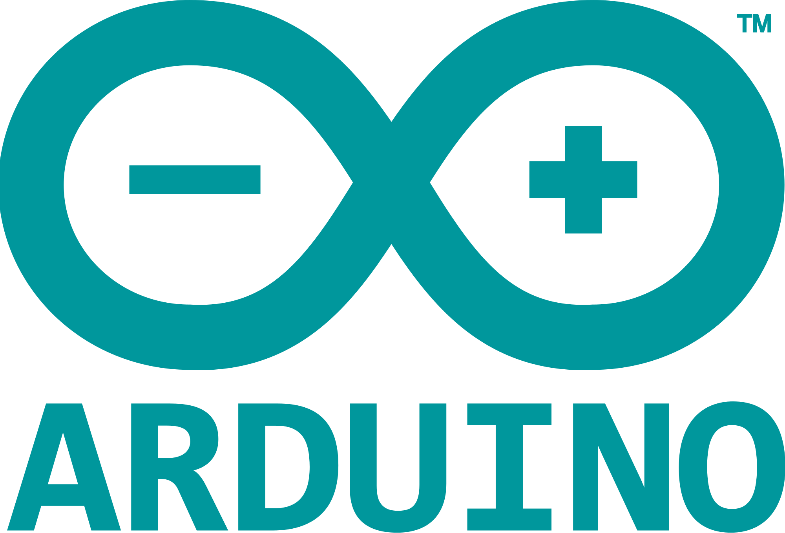

  
  

# Runway + Arduino

A collection of stand alone examples connecting [Runway](https://runwayml.com/) to [Arduino](https://www.arduino.cc/).
Examples are separated by current available models.

## Examples

## Contributing

This is still a work in progress. Contributions are welcomed!

