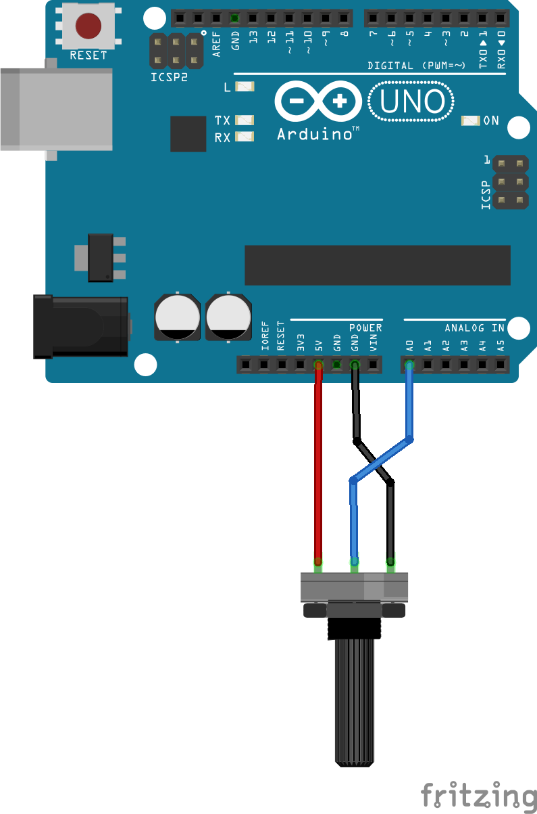
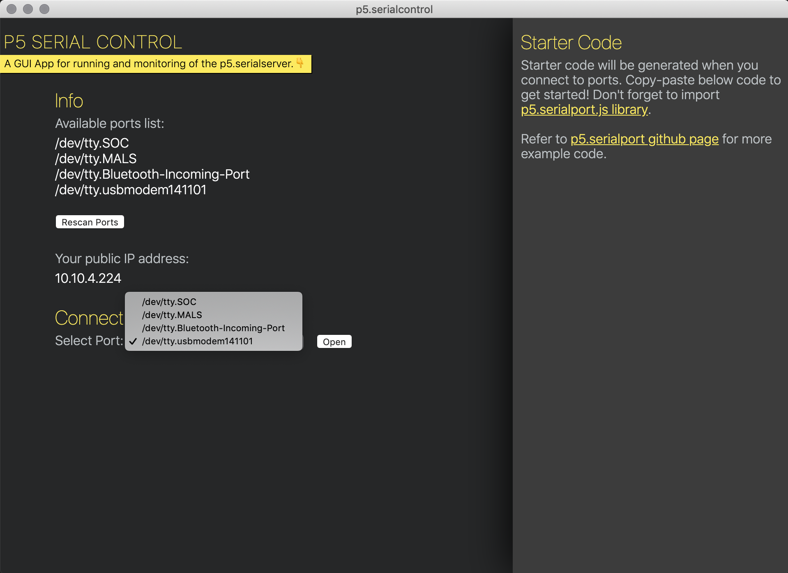
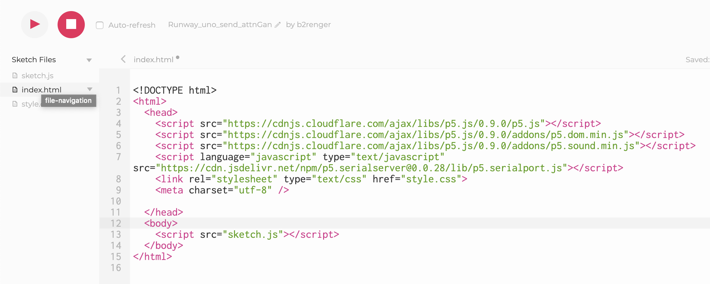

# Send data to AttnGAN from Arduino Uno

The goal will be to use a potentiometer to navigate through the lines of a poetry and generate an image for each line using the AttnGAN model.

## List of parts necessary

- a arduino uno
- a breadboard
- a 10kohms potentiometer


## RunwayML setup
The runwayml is pretty straight forward :
- in the model directory look for the "AttnGAN" model which will take up some text to transform it to an image.
- run it 
- click on the network tab.
- make sure that in the input window http is selected.

The network tab will give usefull informations on how the input should be formatted eg **Input Specification**, the **server address** and **port** number, aswell as the usable **routes** to get/send data from/to the model.

In our case :

- we should send a **JSON** string with this kind of data :

    ```json
    {"caption":"the text I want to translate to image"}
    ```

- we want to send data to runwayml so we need to use the **POST** route from arduino to our computer running runway so our httpRoute will look something like:

    ```
    http://my-computer-ip:runway-port/query
    ```

As everything will happen locally on your computer you don't need to bother to know your IP adress. Using 'localhost' should be enough.


## The circuit

Our circuit will be as follows :



## Running the example

### with p5js

- First you need to make the connections between the potentiometer and the arduino card as shown just above.

- Then you need to flash your arduino board with the code provided as a **.ino** file. If you don't know how to do this you can follow this guide : https://www.arduino.cc/en/Guide/ArduinoUno#toc2

- After that you need to open the **p5.serialcontrol** application, select the same board you upload your programm to and click on 'open' :



This will act as a server and forward the data you write on the serial port to our webpage.

- Launch runway set it up as mentionned above an click on 'run'

- Go to this page : https://editor.p5js.org/b2renger/sketches/HSu5bjj3P
and click on 'play'.

### with processing

- First you need to make the connections between the potentiometer and the arduino card as shown just above.

- Then you need to flash your arduino board with the code provided as a **.ino** file. If you don't know how to do this you can follow this guide : https://www.arduino.cc/en/Guide/ArduinoUno#toc2

- Launch processing

- install the runwayMl library (if you don't know how to do this you can find more there : https://github.com/processing/processing/wiki/How-to-Install-a-Contributed-Library)

- Launch runway set it up as mentionned above an click on 'run'

- run the processing sketch provided


## Arduino code break down

### Read data from a potentiometer
The arduino code will read the value from a potentiometer, map it to an index so we can fetch a line of poetry stored in an array of strings.

From this line we will build a JSON object with the specifications mentionned above and simply print it in ou serial output.

First things first we will open a serial connection in the setup() :
```c
void setup() {
  Serial.begin(9600);
}
```
then we need to read a value on the pin **A0** and [map](https://www.arduino.cc/reference/en/language/functions/math/map/) it to a new value (our poetry will have 5 lines).

```c
void loop() {
  int index = map(analogRead(0), 0, 1023, 0, 5);
}
```

To avoid printing a lot of data and sending a lot of data to our middleware application, we will be sure that data is writtent on the serial port only when the 'index' value has changed. For this we will create a global variable called *pindex* that will keep track of the last value of *index* which is our current reading. So if the value of *index* is not the same as *pindex* that means something has changed and we can send data to our middleware.

So before the setup(), you need to create a variable

```c
int pindex = 0;
```

In the draw() you need to make a test :

```c
// test if the value has changed from previous frame
if (pindex != index) {
  pindex = index;
  // (...) more code to write data to serial
}
```
### Store and access lines of text
Our data is a line of poetry, to access this data we will store our poetry in an array of *String*, we can declare it and initialize it before the setup() :

```c
// Alfred Lord Tennyson - THE EAGLE
String  poem [] = {
  "He clasps the crag with crooked hands;",
  "Close to the sun in lonely lands,",
  "Ring’d with the azure world, he stands.",
  "The wrinkled sea beneath him crawls;",
  "He watches from his mountain walls,",
  "And like a thunderbolt he falls."
};
```

This means we can access every line easily with an index value, for instance :

```c
Serial.println(poem[1]); // returns "Close to the sun in lonely lands,"
```

### Format to json an post to serial bus
Now we just have to format this data to a JSON object and print it to our serial bus. We use the [arduinoJSON](https://arduinojson.org/) library for that - you can follow [this guide](https://www.arduino.cc/en/guide/libraries) to do so.

First we need to include the library in our code. This should be the very first line :
```c
#include <ArduinoJson.h>
````
Then in between the brackets of the *if* statement we wrote earlier we will :

- create a json object
  ```c
  // Create a json object with the correct formatting from our poem
  // Use arduinojson.org/assistant to compute the capacity.
  // use the longest phrase of the poem to compute the size
  const size_t capacity = JSON_OBJECT_SIZE(1) +55 ;
  DynamicJsonDocument root(capacity);
  ```

- add an entry to it
  ```c
  // Add data to it : key == "caption" / content == line from our poem
  root["caption"] = poem[index];
  ```

- write the data to the serial bus
  ```c
  // write data to a string with json formatting
  String json;
  serializeJson(root, json);
  Serial.println(json);
  ```
The data is now ready to be retrieved and processed in P5js or in processing.

## Code break down for P5js

You will need to have the **p5.serialcontrol** application running and connected to your arduino card running the arduino code example provided.

You will be able to find the p5js client code here : https://editor.p5js.org/b2renger/sketches/HSu5bjj3P

If you start from scratch note that you will need to add the [p5.serialport](https://github.com/p5-serial/p5.serialport) library to your **index.html** file.



line 7 :
```html
<script language="javascript" type="text/javascript" src="https://cdn.jsdelivr.net/npm/p5.serialserver@0.0.28/lib/p5.serialport.js"></script>
```

### Getting the serial connection setup
To get the data from the potentiometer we need to create a variable to deal with our serial connection. This variable will be an instance of a *serial* object on which we can call several functions.

First let's create a variable before the setup() :

```js
let serial; // instance of a serial connection
```
Then in the setup() we will configure everything we need ie :

- initialise the object 
  ```js
  serial = new p5.SerialPort();
  ```
- connect it to our physical arduino board
  ```js
  // Assuming our Arduino is connected, let's open the connection to it
  // Change this to the name of your arduino's serial port
  serial.open("/dev/tty.usbmodem145101");
  ```
- define a callback function to be sure our connection is operational :
  ```js
  // When we connect to the underlying server
    serial.on('connected', serverConnected);
  ```
  This actually means that we need to create a new function that will be called when we are connected to the server which is run by the *p5.serialcontrol* application.
  (This code needs to be outside the *setup()*)
  ```js
  // We are connected and ready to go
  function serverConnected() {
    print("Connected to Server");
  }
  ```
- define a callback function to write the code we need to execute when data arrives :
  ```js
  // When we some data from the serial port : callback the 'gotData' function
  serial.on('data', gotData);
  ```
  we will define it and leave it empty for now.  (This code needs to be outside the *setup()*)
  ```js
  // There is data available to work with from the serial port
  function gotData() {
  }
  ```
Now the connection between our arduino code and our webpage should be working, we now have to get the data and process it. We will now mainly write code in the *gotData* function we just defined.

### Receiving data from arduino
When data is writtent by arduino on the serial bus, our js code automatically fires up the got data function. To read the data we can use the **serial.readLine()** function

```js
// There is data available to work with from the serial port
function gotData() {
  let currentString = serial.readLine(); // read the incoming string
  trim(currentString); // remove any trailing whitespace
  if (!currentString) return; // if the string is empty, do no more
  console.log(currentString);
}
```
One thing that is important is to parse the json string we receive to be able to use it correctly. We will want to display the received text in our canvas, so we need to create a variable to store it - we do that before the setup()
```js
let txt;
```
In the **gotData** function we will use the **[JSON.parse](https://developer.mozilla.org/en-US/docs/Web/JavaScript/Reference/Global_Objects/JSON/parse)** function from vanilla javascript to convert our json string to a valid json object and store the result in our new variable :
```js
  txt = JSON.parse(currentString); // parse the json string read from arduino to a json object
  console.log(txt);
```
This way we can display it in our canvas by adding this line of code to the **draw** function :

```js
 if (txt != null) text(txt.caption,width*0.5, height - 20);
 ```
Thanks to the json.parse function we are able to access the key inside a json object using a dot '**.**'.

Now we want to send our json object to runway for it to generate an image.

### Sending data to runway
To do so we will use the **[httpPost()](https://p5js.org/reference/#/p5/httpPost)** function from the p5js library.

This function will help us to post a request to a http server by specifying the *path*, the *data* and a callback function to handle the *response*.  

The path is given by runway in the network tab (see above in the runway setup section). The data is the JSON object we extracted and not the JSON string received from arduino.

First we will leave the response callback function empty :

```js
// post the json file to runway and handle the response as an anonnymous function
  httpPost("http://localhost:8000/query", txt, function(response) {
    console.log(response)
  })
```

### Receive data back from runway
Now it's time to complete the code of our anonymous callback function that is passed to our httpPost request.

The response of runway will be an image. To handle it we will create a variable to store and display the image. So before the setup we create a new variable

```js
let img; // hold the image generated by runway and received with http
```
And in the callback we will parse the response and load the image in this new variable

```js
httpPost("http://localhost:8000/query", txt, function(response) {
    //console.log("got response");
    let data = JSON.parse(response);
    img = loadImage(data.result);

  })
```
We can now draw the received image to our canvas by adding this final line of code to the draw function

```js
if (img != null) image(img, width*0.5, height*0.5, width,height);
```


## Code break down Processing


